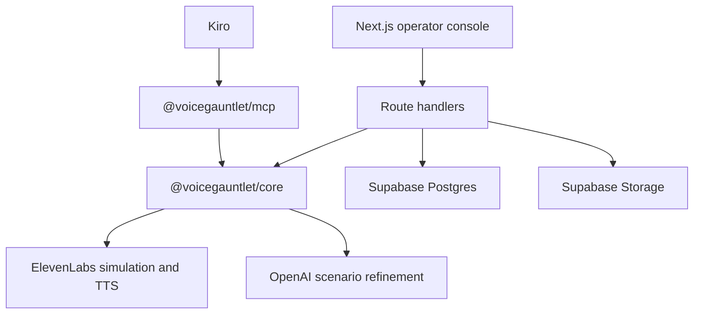

# Design Document: VoiceGauntlet

## Overview

VoiceGauntlet is built as a TypeScript monorepo with a Next.js operator console, a shared core package, a Supabase-backed persistence layer, and a Kiro-installable MCP server.

## Architecture

## Components

- `apps/web`: public demo, authenticated app surface, API routes, browser proof.
- `packages/core`: deterministic parser, scenario generator, evaluator, shrinker, adapters, demo data.
- `packages/mcp`: MCP tools for suite generation, smoke runs, shrinking, task export, and run lookup.
- `supabase`: migrations, RLS, storage buckets.
- `.kiro`: specs, steering, hooks, MCP config, and fixtures.

## Data Flow

1. Import Markdown from `.kiro/specs/**/requirements.md`.
2. Parse requirements and EARS acceptance criteria.
3. Generate adversarial scenarios.
4. Run ElevenLabs simulation or seeded demo fallback.
5. Normalize transcripts and criteria.
6. Evaluate pass/fail by requirement.
7. Shrink failures.
8. Export Kiro hardening tasks.

## Error Handling

All external calls are server-side. ElevenLabs and OpenAI failures return recoverable errors and keep the seeded demo available. Secrets never enter browser bundles.

## UI Strategy

The UI is an operator console: left spec/run rail, center waveform plus transcript, right verdict and task export. It follows the Czarflix editorial style: warm dark base, restrained sand accent, border-led density, and one dominant action per surface.
