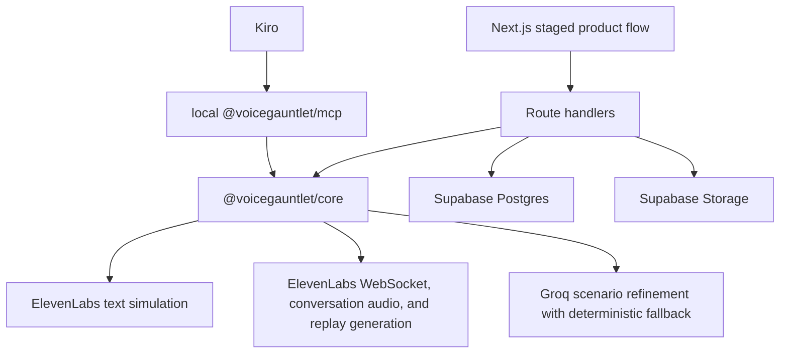

# Design Document: VoiceGauntlet

## Overview

VoiceGauntlet is built as a TypeScript monorepo with a minimalist Next.js product surface, a shared core package, a Supabase-backed persistence layer, and a local Kiro MCP server.

## Architecture

## Components

- `apps/web`: public demo, authenticated app surface, API routes, browser proof, and minimalist staged workflow.
- `packages/core`: deterministic parser, scenario generator, evaluator, shrinker, adapters, demo data.
- `packages/mcp`: local MCP tools for suite generation, smoke runs, shrinking, task export, and run lookup.
- `supabase`: migrations, RLS, storage buckets.
- `.kiro`: specs, steering, hooks, MCP config, and fixtures.

## Data Flow

1. Import Markdown from `.kiro/specs/**/requirements.md`.
2. Parse requirements and EARS acceptance criteria.
3. Generate adversarial scenarios.
4. Run ElevenLabs text simulation for bulk QA, or use a clearly labeled demo fixture.
5. Normalize transcripts, tool calls, criteria, and source provenance.
6. Evaluate pass/fail by requirement.
7. Let authenticated users start Live Monitor: synthetic caller PCM is played locally and sent to ElevenLabs Agent WebSocket, while agent audio chunks are played live in the browser.
8. Produce forensic replay evidence for the worst failure: recorded call when backed by conversation audio, otherwise generated replay from the real transcript.
9. Shrink failures.
10. Export Kiro hardening tasks.

## Error Handling

All external calls are server-side. ElevenLabs and Groq failures return recoverable errors and keep the seeded demo available without pretending that a failed provider call succeeded. Secrets never enter browser bundles.

## UI Strategy

The UI is a minimalist staged flow: `Spec`, `Run`, `Failure`, `Forensic Replay`, `Shrink`, `Kiro Task`, `Green`.

Use a light, print-clean surface with warm off-white canvas, charcoal text, crisp borders, sparse controls, and one primary action per stage. The transcript and audio evidence are the hero. Secondary stats stay hidden behind inspectable details. Never show a fake waveform when no audio exists.

Live Monitor is available only in the authenticated workspace. It is a live proof strip, not the bulk evaluator. The app plays synthetic caller audio locally, sends it as `user_audio_chunk` frames, plays ElevenLabs `audio_event.audio_base_64` chunks as they arrive, and checks for recorded-call metadata after close.

## Evidence Labels

- `ElevenLabs simulation`: text transcript and analysis from `simulate-conversation`.
- `Live agent stream`: transient browser playback from Agent WebSocket chunks.
- `Recorded ElevenLabs call`: actual conversation audio exists and is backed by conversation metadata.
- `Generated replay`: two-speaker audio from a real transcript. The live replay route uses ElevenLabs Text to Dialogue when a valid key is configured.
- `Demo fixture`: preverified public proof artifact, not a live run.
