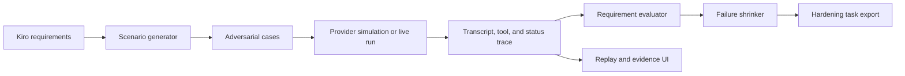

# VoiceGauntlet architecture

VoiceGauntlet is a QA and red-team lab for voice-agent requirements. Its public demo is deliberately fixture-backed; provider-backed runs require private credentials and an authenticated environment.

## Evidence levels

- **Synthetic scenario:** generated input with no provider execution.
- **Fixture:** checked-in deterministic data used by the public demo.
- **Generated replay:** audio or transcript generated from a known trace.
- **Recorded interaction:** provider metadata and audio identify a real interaction.
- **Live integration:** authenticated provider call with runtime metadata.

The UI and exported traces must preserve this distinction. A fixture or generated replay is not a production incident.

## Privacy boundary

Provider credentials remain server-side. Public fixtures must contain synthetic identities and sanitized transcripts. Do not commit cookies, session profiles, customer recordings, or provider access tokens.
